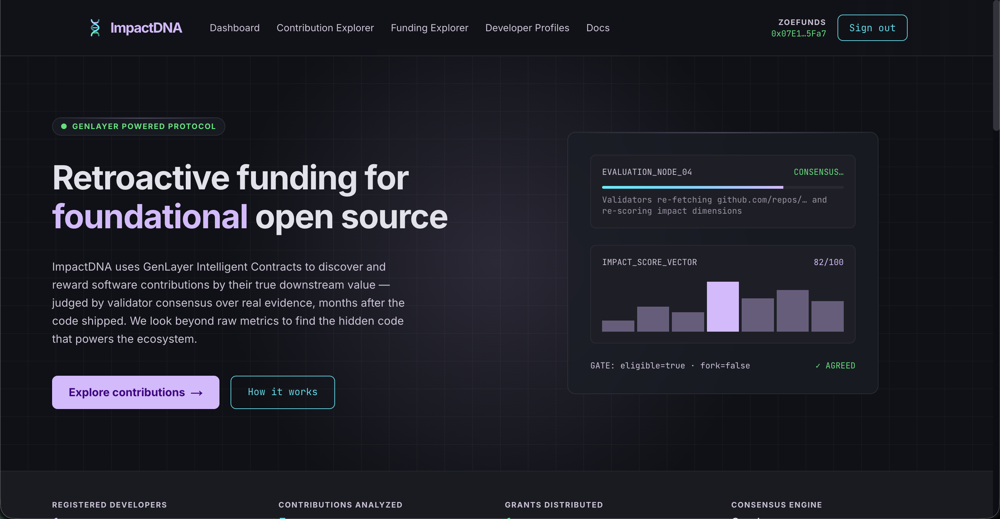
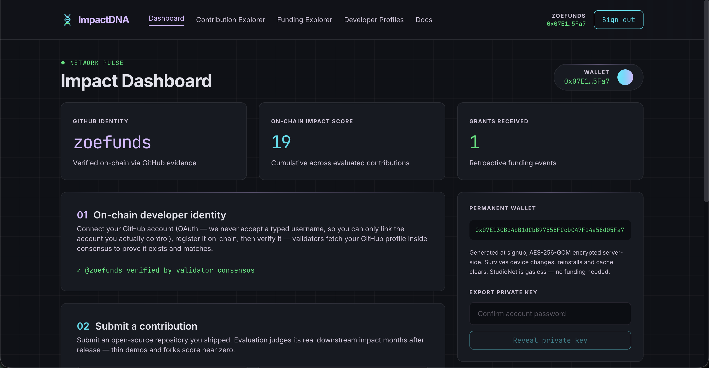
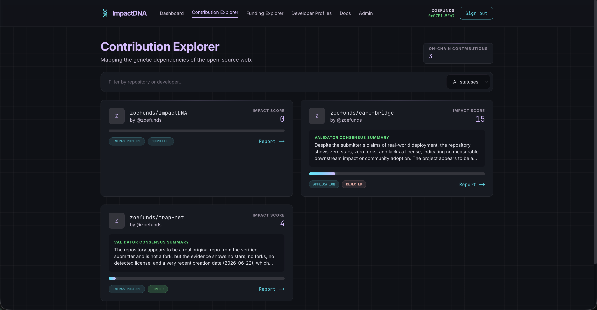
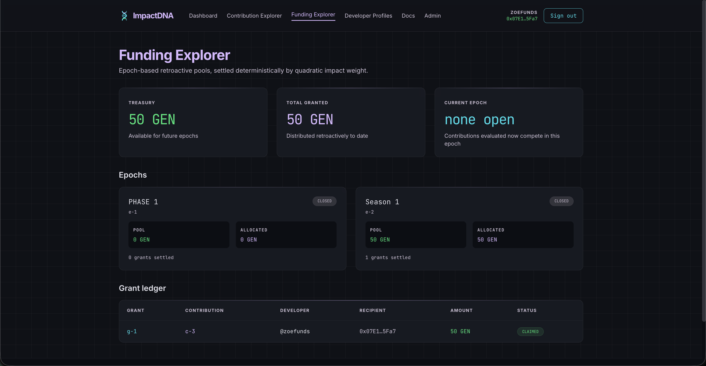
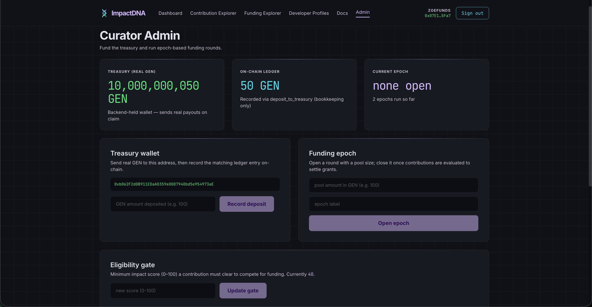

# ImpactDNA

**Retroactive Public Goods Funding on GenLayer.**

ImpactDNA flips the traditional grants model: instead of funding proposals before work begins, it evaluates open-source repositories *after* release and rewards the ones that became genuinely foundational. The subjective judgment — is this work original, adopted, influential? — is performed entirely by a **GenLayer Intelligent Contract**: validators independently fetch live GitHub evidence and score impact with LLM reasoning, reaching consensus before anything is recorded or funded. Grants are then paid out in **real GEN, escrowed and sent directly by the contract itself** the moment a developer claims them on-chain.



## Live deployment

| Component | URL / Address |
|---|---|
| **Web app** | [impactdna.vercel.app](https://impactdna.vercel.app) |
| **REST API** (24/7, health-checked) | [impactdna-api.fly.dev](https://impactdna-api.fly.dev) |
| **Intelligent Contract** | [`0x509382e2c63814aCD85ECA415251E8C1f92620F3`](https://studio.genlayer.com) — GenLayer StudioNet (gasless) |
| **Contract owner / curator** | `0x07E130Bd4bB1dCbB97558FCcDC47F14a58d05Fa7` |

Constructor: `platform_name="Impact_DNA"`, `min_eligible_score=40` (owner-adjustable from the admin panel).

This is a freshly redeployed contract that moves real GEN custody in-contract (see [Real GEN escrow](#real-gen-escrow-held-directly-in-the-contract) below). Ownership has been transferred to the app's own curator wallet, and a real 10 GEN deposit has been confirmed landing directly in the contract's balance on *this specific deployment*. The rest of the lifecycle — submit → evaluate → open epoch → close epoch → claim (atomic payout) — is queued for a fresh end-to-end pass; the previous deployment's full lifecycle, including a real 50 GEN payout on claim, `detect_manipulation`, and `request_appeal`/`resolve_appeal`, was already exercised live with 5-validator consensus throughout, on the same escrow mechanism now used directly by this contract.

## How it works

```
Developer connects GitHub via OAuth (never a typed username — you can only
link an account you actually control) + registers + verifies on-chain
         |
         v
Submits a repository with category + description
         |
         v
Evaluation: leader fetches repo from GitHub, scores 5 dimensions (0-20 each)
with LLM reasoning. Every validator independently re-fetches and re-scores.
Hard gates (fork/ownership/eligibility) must match exactly; scores must land
in the same or adjacent 25-point bucket.
         |
         v
Score >= gate --> eligible for funding   |   Score < gate --> rejected (appeal available once)
         |
         v
Curator deposits real GEN directly into the contract + opens an epoch with a pool
         |
         v
Curator closes epoch --> pool split deterministically by quadratic weight (score^2)
         |
         v
Developer claims grant on-chain --> contract sends real GEN to the developer's
wallet in the same transaction (see Real GEN escrow below)
```

### Impact dimensions (0-20 each, 100 total)

| Dimension | What validators look for |
|---|---|
| **Downstream usage** | Is anything built on top of it? Dependents, imports, integrations |
| **Technical importance** | Does it solve a hard, foundational problem? |
| **Originality** | Is it novel work? Forks get `originality=0` and a 30-point cap automatically |
| **Ecosystem influence** | Did it shape how others build in the ecosystem? |
| **Community adoption** | Stars, forks, contributors relative to its niche |

### Anti-gaming protections (deterministic, not LLM)

- Forks: `originality=0`, hard 30-point cap
- Non-owned repos: capped below the eligibility gate
- Volatile metrics (stars/forks): enter evidence only as order-of-magnitude buckets
- Duplicate repos and per-developer submission caps enforced in contract state
- Curator-triggered manipulation screening (`detect_manipulation`) with comparative validation, immutable once funded
- Appeals (`request_appeal` / `resolve_appeal`) require *fresh evidence that materially contradicts the original decision* — a well-argued complaint alone is denied

### Consensus reliability

Errors are classified (`[EXPECTED]` / `[EXTERNAL]` / `[TRANSIENT]` / `[LLM_ERROR]`) so validators agree on failure paths instead of rotating leaders. Score tolerance uses adjacent 25-point buckets — honest evaluations converge instead of ending UNDETERMINED, while a leader who lies about a hard gate (fork status, ownership, eligibility) is always caught.

## Why GenLayer (and not an off-chain AI app)

Every judgment that matters happens inside the contract under multi-validator consensus:

- **Identity verification** — validators re-fetch `api.github.com/users/<name>` inside the contract; `strict_eq` over stable fields (id, login, type, created_at). No user-submitted claim is trusted.
- **Impact evaluation** — leader and validators independently fetch the repository, score with LLM reasoning, and cross-check substance (gates, buckets, repo identity). Never format-only validation.
- **Funding settlement** — pure integer math: `pool * score^2 / sum(score^2)`. Trivial consensus by construction.

An off-chain AI could score repositories, but there would be no way to verify that the scoring was honest, consistent, or tamper-proof. GenLayer makes every evaluation auditable and adversarially robust.

## Real GEN escrow, held directly in the contract

Real GEN custody and payouts live entirely on-chain — no off-chain treasury wallet, no backend private key, no intermediary that could go down or be compromised independently of the contract itself:

- `deposit_to_treasury` is `@gl.public.write.payable` — a curator's deposit is real GEN value attached to the call (`gl.message.value`, never a caller-supplied number), credited straight into the contract's own balance.
- `claim_grant` pays out directly: it marks the grant claimed and debits the treasury ledger *before* transferring — checks-effects-interactions — so a second claim call (re-entrant or repeated) finds the ledger already reduced and the grant already claimed, making double-spend structurally impossible. The transfer itself routes through a single choke point (`_send_gen`), using an EVM-interface stub (`_Recipient(...).emit_transfer(value=...)`) — the mechanism GenVM actually uses to deliver native value to a plain wallet, confirmed by a live probe on this exact pinned runner.
- If a payout ever needs recovering (e.g. a mis-set grant amount), it's a contract-level fix, not a matter of retrying a separate off-chain transaction — there's only one source of truth for whether GEN moved.

## Screenshots

| Dashboard | Contribution Explorer |
|---|---|
|  |  |

| Funding Explorer | Curator Admin panel |
|---|---|
|  |  |

## Curator admin panel

A dedicated `/admin` panel (curator/admin role required) replaces manual Studio/CLI calls for day-to-day operation:

- **Treasury deposit** — deposit real GEN directly into the contract in one transaction (GEN-denominated input, converted to atto client-side, no more typing 18-zero atto strings)
- **Funding epoch** — open a round with a GEN pool size and label, or close the open epoch to settle grants
- **Eligibility gate** (admin only) — adjust `min_eligible_score` (0–100) as the platform's repo pool matures
- **Curator management** (admin only) — add/remove curators on-chain; owner-gated by the contract itself

### Why epoch-opening and curator access aren't open to everyone

`open_epoch`, `deposit_to_treasury`, and curator management are deliberately gated to the `curator`/`admin` roles, enforced both in the backend RBAC middleware and independently by the contract itself (`_require_curator`, `_require_owner`). This isn't an oversight to relax later — it's the control that keeps the treasury and funding rounds honest:

- **`open_epoch` controls real money.** A pool size is backed by real GEN held directly in the contract. If any registered user could open epochs, nothing would stop someone from opening a round timed to their own pending submission, or spamming epochs to lock out a legitimate one.
- **`deposit_to_treasury` moves real funds into the contract.** It's a `payable` call — the deposited amount comes from the transaction's own value, not a claimed number, so it can't be faked. But it's still curator-gated: letting anyone call it would let anyone dictate when and how much enters the funding pool, which is a funding-round-integrity problem even though the amount itself can't be lied about.
- **Curator management is owner-gated for the same reason ownership matters anywhere:** it's the one power that can't be sandboxed. Adding a curator is adding someone who can move real funds; the contract enforces this at the code level (`add_curator`/`remove_curator` both call `_require_owner()`), so even a compromised backend account can't grant itself curator status without the actual owner key.
- **This is a permissions problem, not a UX problem.** Anyone can register, verify their GitHub identity, submit contributions, and claim grants they're eligible for — that's the entire user-facing surface, and it's fully open. Curator power is scoped narrowly on purpose, the same way a bank doesn't let every account holder approve wire transfers just because the UI would be simpler that way.

In short: opening this up would trade a small amount of curator friction for a large, unrecoverable trust hole. The mitigation isn't removing the gate — it's making the gate cheap to operate (which is what the `/admin` panel is for) and adding more independent curators over time, rather than concentrating or eliminating the role.

## Repository layout

```
contracts/impact_dna.py    Intelligent Contract (1,500+ lines, genvm-lint clean,
                           pinned runner hash)
backend/                   Node 20 + TypeScript + Express (Fly.io, 24/7)
  src/routes/               Auth (incl. GitHub OAuth), contributions, platform,
                            admin (curator/treasury/eligibility ops)
  src/lib/                  GenLayer client, wallet encryption, GitHub OAuth,
                            email, Redis, logger
  src/middleware/           JWT auth, rate limiting, error handling
  migrations/                Forward-only SQL migrations (run at boot)
frontend/                  Next.js 14 + Tailwind CSS (Vercel)
  app/                      Landing, dashboard, explorer, contribution detail,
                            funding, developers, docs, auth pages, admin panel
  components/               Glassmorphism UI kit, nav, footer, auth shell
docs/                       ARCHITECTURE.md, DEPLOYMENT.md, API.md, screenshots/
.github/workflows/ci.yml   Contract lint + backend & frontend builds
docker-compose.yml         Local PostgreSQL (port 5439)
```

## Tech stack

| Layer | Technology |
|---|---|
| Intelligent Contract | Python, GenLayer VM, `gl.vm.run_nondet_unsafe`, pinned runner |
| Backend | Node.js 20, TypeScript, Express, PostgreSQL, Upstash Redis, Brevo |
| Frontend | Next.js 14, React 18, Tailwind CSS, TypeScript |
| Infrastructure | Fly.io (24/7), Vercel, Docker, GitHub Actions CI |
| Crypto | ethers.js (custodial wallet generation), AES-256-GCM (key encryption), bcrypt(12) |
| Chain interaction | genlayer-js SDK |
| Identity | GitHub OAuth 2.0 (signed, short-lived state JWT — no typed usernames) |
| Email | Brevo transactional HTTP API, every send logged to `notification_log` |

## Platform features

- **GitHub OAuth developer identity** — users connect via OAuth (never a typed username), so an account can only be linked by someone who actually controls it; `github_id` is uniquely constrained so one GitHub account can't be linked to multiple ImpactDNA accounts.
- **Email + password auth** with JWT access tokens (15-min) and rotating refresh tokens (7-day). Brevo-powered password reset with 30-minute one-time tokens.
- **Permanent custodial wallets**: generated at signup with ethers, AES-256-GCM encrypted at rest. Address never changes, survives device/browser resets. Private-key export requires password re-confirmation. StudioNet is gasless, so users transact without holding tokens.
- **Real GEN escrow and payouts**: held directly in the contract, paid out atomically on claim — see [Real GEN escrow](#real-gen-escrow-held-directly-in-the-contract) above.
- **Transactional email** via Brevo HTTP API: welcome, password reset, submission confirmation, evaluation results, grant claimed — every send (success or failure) logged to `notification_log`.
- **Conservative Redis usage** (Upstash, billed per command): single lazy connection, in-process micro-cache (Map, max 500 entries) in front of every read, TTL on all keys, fixed-window rate limiter costing 1-2 commands per hit, graceful degradation to in-memory if Redis is unreachable. Curator/treasury writes explicitly invalidate the cached platform-info read so the admin panel never shows stale state after an action.
- **24/7 backend**: Fly.io with `auto_stop_machines="off"`, `min_machines_running=1`, restart policy `always`, `/health` endpoint checked every 30 seconds, externally monitored via UptimeRobot.
- **Self-healing mirror**: the dashboard reads a local Postgres mirror table that automatically reconciles with authoritative on-chain records when stale data is detected.
- **Security**: helmet, strict CORS allowlist, Zod validation on every input, bcrypt(12), RBAC (developer/curator/admin), audit logging on-chain and in Postgres, secret-redacting structured logs (pino), fail-fast environment validation.

## Quick start (local)

```bash
git clone https://github.com/zoefunds/ImpactDNA.git && cd ImpactDNA
docker compose up -d                          # PostgreSQL on :5439
cd backend && cp .env.example .env            # fill in secrets
npm install && npm run build && npm start     # API on :8080
cd ../frontend && npm install && npm run dev  # web on :3000
```

## Operating a funding round (curator)

The recommended path is the **`/admin` panel** (see [screenshots](#screenshots) above) — deposit GEN, open/close epochs, and adjust the eligibility gate without leaving the app. The same operations are available directly against the contract for scripted or emergency use:

```bash
# deposit_to_treasury is payable — the deposit is the real GEN value attached
# to the call, not a calldata arg. The genlayer CLI's `write` command doesn't
# expose a --value flag, so deposit from Studio's UI (which has a value field)
# or the /admin panel; use the CLI for everything else below.

# Open an epoch with a 50 GEN pool
genlayer write 0x0B20…5978 open_epoch --args 50000000000000000000 "Season 1"

# Developers submit and evaluate during the epoch...

# Close epoch — deterministic quadratic settlement
genlayer write 0x0B20…5978 close_epoch

# Resolve any open appeals / run a manipulation screen
genlayer write 0x0B20…5978 resolve_appeal --args a-1
genlayer write 0x0B20…5978 detect_manipulation --args c-1

# Adjust the eligibility gate (owner only)
genlayer write 0x0B20…5978 set_min_eligible_score --args 40
```

## Current stage & path forward

ImpactDNA is live on GenLayer StudioNet with the full lifecycle working end-to-end — including real GEN payouts — but adoption so far is deliberately small: one curator (the founder), one verified developer account, and three test contributions submitted to exercise evaluation, rejection, and funding in practice. That's a testnet dogfooding stage, not a live community yet, and worth being upfront about.

Concrete next steps:

- **Onboard real external developers.** The GitHub OAuth + evaluation pipeline is ready for anyone to connect their own account and submit a real shipped repo — the next milestone is getting the first cohort of unaffiliated maintainers through it.
- **Recruit additional curators.** Right now one wallet holds owner + curator power. The contract and admin panel already support adding independent curators (`add_curator`); spreading that role out is a trust improvement, not just a feature.
- **Mainnet deployment.** StudioNet is gasless and free to experiment on; moving to a live GenLayer network is the natural next step once a funding round has run with real external contributions.
- **Recurring funding rounds.** The quadratic-settlement math has been reasoned through and unit-verified but only exercised live with a single eligible contribution per epoch so far — a real round with multiple competing developers is the next proof point.
- **Community treasury funding.** Today the treasury is funded manually by the curator; a natural evolution is accepting deposits from anyone who wants to back a round, not just the platform operator.

## Documentation

- [Architecture](docs/ARCHITECTURE.md) — system design, data flow, consensus model
- [Deployment](docs/DEPLOYMENT.md) — step-by-step for contract, Fly.io, Vercel
- [API Reference](docs/API.md) — all endpoints, auth, request/response schemas

## License

MIT
